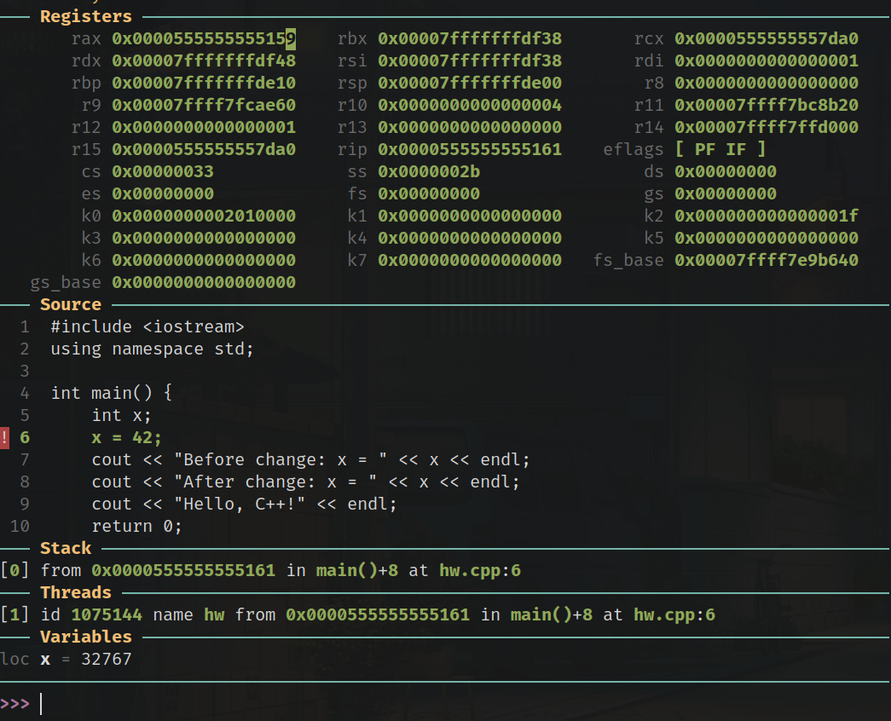

## Registers and Pointers
Before i go on, I want to cover typical registers and pointers used program execution even though its a bit out of the scope of C++.

#### What are registers?
- Extremely fast bits of countably small memory used directly by the CPU
- They are standardised by ISA (instruction set architecture)
- **Each register is 16 positions of Hex i.e. 64bits long or 8 bytes**
    * Notably, the size of memory addresses in 64 bit architecture
Lets start by looking at registers in GDB:

#### Are registers hard locations or are they abstraction
- **They are NOT an abstraction they're on the CPU physically**
- Well hold, my computer is running many programs, while i'm sat in my breakpoint surely these registers are just hogged by my C++ program?
    * Correct, I already guessed the answer t my own question here, the OS context switches these values out and in when it's C++'s turn on the CPU

#### Why aren't there more registers?
- They are simply that expensive to have on the CPU. More die area etc.
- Adding more registers means more complex instructions
    * Right now, compilers know which registers they're getting. They know how to use them. Adding more complicates things
- Diminishing returns?
    * 16 of these registers are all thats needed for C++ and modern code
    * Most attempts to improve have found improvements not worth the cost

#### Hold on, only 16?! Why are the other registers unused? Which 16?
| **Register** | Meaning |
| -------- | -------- |
| **The only...** | **...16 Registers DIRECTLY used by programs like C++** |
| `rax`,`rbx`, `rcx`, `rdx` | General purpose - Often for temp storage, return values, loop counters |
| `rsi`, `rdi` | - Used for function call arguments. Used for first 2 parameters of calling convention. Leftover from old x86, and repurposed rather than removed. `rsi` (source index to source data), `rdi` (destination index to dest memory) |
| `rbp` | The base pointer. (Frame pointer) - Holds the base address of the current stack frame. Used to track function calls? |
| `rsp` | The stack pointer. Holds the address FOREFRONT of the stack - the top (lower memory addresses as the stack grows downards). This will obviously be changing as the stack moves up and down. DONT GET CONFUSED ABOUT TOP vs BOTTOM. So when the function returns, `rsp` resets back down (higher mem address) to `rbp` |
| `r8`, ..., `r15` | 8 general purpose registers. There are no physical difference between these and the `rax` registers, this is simply the most efficient way to seperate things that compilers enjoy. |
| `rip` | The 17th, an exception, Instruction pointer. It points to the address of the current instruction being executed, which is in the read-only text segment of memory |
| **The rest of...** | **...the registers that exist on the CPU but aren't directly used by C++** |